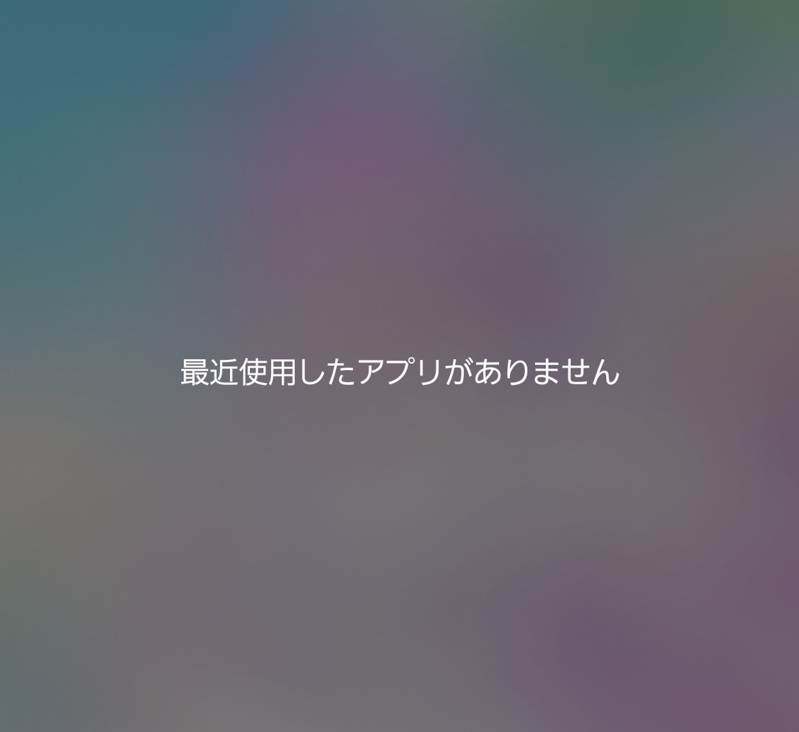

# OnlyShare

A one-tap Android app that hands whatever is on the clipboard straight to the system share sheet.

It has no UI of its own. Tapping the launcher icon opens the share sheet, and nothing else is ever drawn.

## Features

- On launch, the current clipboard content is shared with `Intent.ACTION_SEND`
- The content is not limited to text. A copied picture, PDF or recording is a `content://` URI on the
  clipboard, and is shared as a stream with the MIME type the content resolver reports for it
    - Several URIs at once are shared with `Intent.ACTION_SEND_MULTIPLE`, under the narrowest MIME type that
      covers all of them
    - The URIs are also put in the intent's `ClipData`, which is what actually carries
      `FLAG_GRANT_READ_URI_PERMISSION` to the app the user picks -- `EXTRA_STREAM` alone grants nothing
    - A clip that holds a URI *and* a text label is shared as the URI; the label only describes it
- Everything else is shared as `text/plain`, including HTML, an `http` URI and a clip of several items
  (joined with newlines)
- When the clipboard is empty, the app shows a toast and exits

## Layout

- Language: Kotlin
- UI: none. There is no Compose, no AppCompat and no layout resource
- applicationId: `io.github.aiya000.onlyshare` (`.debug` is appended to the debug build)
- minSdk 26 / targetSdk 35 / compileSdk 35

```
app/src/main/kotlin/io/github/aiya000/onlyshare/
├── MainActivity.kt  -- the invisible window: reads the clipboard, shares, finishes
├── Clipboard.kt     -- what the clipboard holds, and the MIME type that covers it
└── Share.kt         -- builds the ACTION_SEND / ACTION_SEND_MULTIPLE intent
```

## Notes

Since Android 10 (API 29), only the foreground app that holds the window focus may read the clipboard.
`MainActivity` therefore reads it in `onWindowFocusChanged`, not in `onCreate`.

That is also why `@android:style/Theme.NoDisplay` cannot be used for an activity that shows nothing: an
activity with that theme never receives the window focus, and so never gets to see the clipboard. The app uses
a transparent translucent theme instead, and simply draws nothing into it.

The app never appears in the recent apps screen (the task switcher). Its activity is declared with
`android:excludeFromRecents="true"`, because there is nothing to come back to -- by the time the share sheet is
up, the activity has already finished. So a missing entry in the recents list is not a sign that the app failed
to run.



## Building

Android Studio is not needed. An Android SDK (platform 35, build-tools) and JDK 17 are enough.

Point `local.properties` at the SDK.

```properties
sdk.dir=/path/to/Android/Sdk
```

With JDK 17 on `PATH`:

```console
$ ./gradlew :app:assembleDebug
```

This produces `app/build/outputs/apk/debug/app-debug.apk`.

When the JDK is managed by mise:

```console
$ mise exec java@17 -- ./gradlew :app:assembleDebug
```

## Installing

```console
$ adb install -r app/build/outputs/apk/debug/app-debug.apk
```

The debug build uses its own application id, so it installs next to the release build. It is the one with the
orange launcher icon, labelled `OnlyShare debug`.

The release build is unsigned, because the project declares no signing config. Sign it yourself before
installing it, for example with the Android debug keystore for a personal build.

## License

[MIT License](LICENSE)
